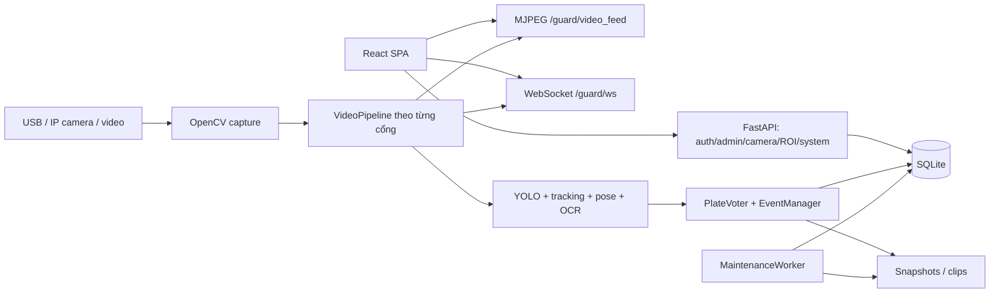

# Đánh giá cấu trúc và cải tiến camera — 30/09/2026

## Kết luận

Dự án đã vượt giai đoạn demo một webcam: có nhiều cổng, phân quyền, tracking, OCR voting, xác nhận sự kiện qua nhiều frame, ROI, clip bằng chứng, ghép sự kiện giữa camera và bảo trì nền. FastAPI + React + SQLite phù hợp để tiếp tục phát triển ứng dụng chạy tại máy edge. Nên sửa vòng đời camera và lỗi tích hợp trước, sau đó tách trách nhiệm từng phần; chưa có cơ sở để viết lại toàn bộ hoặc chuyển ngay sang microservices.

Phạm vi rà soát: cấu trúc thư mục, entrypoint, cấu hình, API/auth, DB, luồng CV/camera, giao diện camera/guard, kiểm thử và tài liệu. Đây là đánh giá kiến trúc và các luồng trọng yếu, không phải xác nhận mọi dòng mã hay đo lại độ chính xác model trên camera trường. Đánh giá dựa trên working tree đang có nhiều thay đổi chưa commit, không chỉ HEAD.

## Bản đồ hệ thống



| Khu vực | Trách nhiệm và đánh giá |
|---|---|
| `app/main.py` | Khởi động DB, worker, pipeline; ghép API và phục vụ SPA/static. Cần test application factory thật thay vì chỉ app dựng riêng trong fixture. |
| `app/api/` | Đã chia auth, camera, ROI, guard, user, system; `admin.py` vẫn gom nhiều nghiệp vụ. |
| `app/cv/` | Đã tách detector, OCR, pose, voter, event manager, correlator, recorder. Tuy nhiên `pipeline.py` hiện 1.476 dòng, còn kiêm điều phối, luật nghiệp vụ, vẽ ảnh, ghi dữ liệu và vòng đời tài nguyên. |
| `app/db.py` | 1.439 dòng, gom schema/migration, học sinh/xe, user, sự kiện, camera, ROI, backup. Khóa ghi và query tham số là nền tốt; nên tách theo nghiệp vụ, giữ chung connection factory. |
| `frontend/src/` | Có pages/components/auth/api/utils; package dùng React 19, README còn ghi 18. Một số trang lớn trộn form, bảng, API và trạng thái. |
| `app/background.py` | Backup và cleanup độc lập với CV; nên giữ cách phân chia này. |
| Tests | `pytest.ini` chỉ thu thập `app/tests`; `tests/test_api_errors.py` và script root là nhóm khác, nhiều script trỏ backend thật. Có Playwright nhưng chưa bao phủ chọn camera trước đợt này. |
| Scripts/docs | Nhiều công cụ QA/training hữu ích nhưng phân tán; kế hoạch và README không còn đồng bộ với mã. |

## Lỗi camera đã sửa

| Trước khi sửa | Thay đổi |
|---|---|
| Webcam lưu DB thành `"0"`/`"1"`, OpenCV hiểu là tên file | Chuẩn hóa về số nguyên ở capture và khi nạp nguồn đã lưu. |
| API ghi nguồn rồi thay pipeline trước khi có hình | POST trả 202; pipeline mở nguồn, đọc frame đầu tiên, lưu DB rồi mới thay capture. Mở/đọc/lưu thất bại thì giữ capture cũ. |
| Đổi camera nạp lại model; MJPEG giữ pipeline cũ | Giữ pipeline instance/model; thay capture giữa các frame trong cùng thread. |
| RTSP xử lý như file EOF, không timeout tường minh | Tách URL/file/device; chỉ file được loop; FFmpeg có open/read timeout 3.000 ms mỗi thao tác. |
| Camera khởi động lỗi làm thread chết | Thread tiếp tục chờ reconnect hoặc lựa chọn nguồn khác. |
| Cổng không tồn tại vẫn có thể ghi DB | Gate 404; source sai 422; pipeline chưa chạy 503; đang chuyển cùng cổng 409. |
| API trả URL có tài khoản/mật khẩu | Preset dùng ID; trạng thái loại userinfo, query và fragment. |
| Cache góc nhìn cũ dùng cho nguồn mới | Reset detection, tracking history, ByteTrack tracker, OCR voter, EventManager và buffer clip. |
| UI báo thành công sớm, nuốt lỗi tải, response cổng cũ có thể đè cổng mới | Form riêng theo cổng, hủy request khi unmount, bỏ response đọc cũ sau POST, polling trạng thái thật và hiển thị lỗi. |
| Nguồn `0` có thể hiện “chưa rõ”, không preview | Hiển thị nguồn dạng chuỗi; thêm preview, tải lại hình, tín hiệu, tuổi khung hình và nhắc kiểm tra ROI. |

Module mới: `app/cv/camera_sources.py` chuẩn hóa/kiểm tra/che nguồn; `app/cv/camera_switch.py` quản lý một yêu cầu chuyển nguồn mỗi cổng. Không đưa logic chọn camera vào luật nhận diện.

API:

- `GET /api/camera`: danh sách cổng cho trang cấu hình.
- `GET /api/camera/{gate}`: nguồn đã che thông tin, preset ID, trạng thái chuyển và health.
- `POST /api/camera/{gate}` với `{ "preset_id": "preset-0" }` hoặc `{ "source": "0" }`: trả 202; đọc GET để biết `checking`, `applied` hay `error`. Không gửi cả hai trường.
- Script cũ gửi `source` vẫn được nhận, nhưng cần xử lý HTTP 202 và chờ trạng thái thay vì coi phản hồi POST là đã có hình.

## Phát hiện còn tồn tại

Chưa sửa các mục này trong đợt chọn camera. Đây là phát hiện qua mã nguồn, trừ kết quả build/lint ghi riêng.

| Mức | Bằng chứng | Hệ quả và hướng sửa |
|---|---|---|
| P0 trước khi đưa ra mạng công khai | `app/config.py:196` có khóa JWT cố định; preset camera chứa thông tin đăng nhập | Chuyển secrets sang môi trường/kho bí mật, xoay khóa đã được chia sẻ, rà tài khoản seed. Che API không xóa secrets khỏi source/DB/lịch sử Git. |
| P1 | `app/main.py:88` mount `/media` bằng StaticFiles không auth | Người có URL ảnh/clip truy cập được không qua phân quyền. Dùng route kiểm tra quyền hoặc URL ký có hạn; test khách/role khác lớp. |
| P1 | `app/main.py:88` mount `/media` trước `/media/student_photos` tại dòng 93 | Mount cha bắt đường dẫn con, tìm ảnh học sinh nhầm trong snapshots. Sửa thứ tự hoặc route riêng; test bằng thư mục tạm. |
| P1 | `app/api/guard.py:110–118` đọc queue gate đang xem rồi gửi mọi client; giữ threading.Lock trong lúc await | Có thể gửi cảnh báo nhầm cổng, chậm client hoặc chặn event loop. Phân phối theo gate; lấy snapshot clients trước await; thêm gate_id vào payload; test nhiều client/client chậm. Split view hiện vẫn đăng ký một gate qua AlertBanner. |
| P1 | `frontend/src/api/client.js:11` cố định `http://localhost:8001` | Máy khác/điện thoại gọi localhost của chính thiết bị đó. Dùng API origin cấu hình hoặc cùng origin, áp dụng cả WS/media. |
| P1 | `app/main.py:127–131` trả 410 cho `/admin/violations` khi có frontend build | URL cũng là route SPA hiện hành: mở trực tiếp/refresh bản production bị lỗi. Bỏ route legacy xung đột, test deep link trên app production. |
| P1 | ROI trong `app/cv/pipeline.py` tính bằng VIDEO_WIDTH/HEIGHT cố định | Video/IP camera có thể trả kích thước khác, làm lệch vùng nhận diện. Quy đổi theo `frame.shape`, cập nhật khi kích thước đổi; test 720p/1080p/video dọc. Đợt này chỉ nhắc kiểm tra ROI. |
| P1 trước khi mở đăng ký rộng | `app/api/register.py:32–50,62–80`: upload/lookup public | Lookup trả tên/lớp/biển theo mã số; upload dựa vào MIME client gửi, tên theo mili giây, thiếu giới hạn tần suất. Cần chống dò mã, kiểm tra ảnh thật, UUID, hạn mức request/dung lượng, dọn ảnh chưa gắn hồ sơ. |
| P2 | `pipeline.py`, `db.py`, `api/admin.py` tập trung nhiều trách nhiệm | Tách từng phần có test giữ hành vi, ưu tiên camera lifecycle và event persistence. Không tách chỉ để giảm dòng. |
| P2 | README nói chưa đa camera/React 18; pytest runtime 9.1.1 nhưng requirements quy định <9 | Đồng bộ tài liệu và môi trường tái lập; khóa bộ dependency đã kiểm chứng; CI môi trường sạch. |
| P2 | Build JS khoảng 850 kB minified; lint còn cảnh báo ngoài phần camera | Lazy-load trang nặng, xử lý warning theo từng trang. |
| P2 | Layout cố định `ml-64`; GuardPage còn LIVE tĩnh và chỉ số gate mặc định | Bổ sung layout màn hình nhỏ và trạng thái stream thực. Nhãn LIVE không chứng minh có frame mới. |

Báo cáo QA cũ về OCR/mũ bảo hiểm là đầu vào điều tra, không phải số đo mới trong phiên này. Không thay model, threshold hay luật vi phạm dựa riêng vào kết luận cũ.

## Phương án phát triển

1. **Ổn định vận hành:** secrets/media, API origin, route SPA, cảnh báo theo cổng. Mỗi lỗi thành một thay đổi có test hồi quy. Nghiệm thu: deep link production hoạt động; hai trình duyệt/hai cổng nhận đúng cảnh báo; media chặn người không có quyền.
2. **Hoàn thiện camera:** tên thiết bị thật khi OS hỗ trợ, báo nguồn đang được cổng khác dùng, quản lý preset, độ phân giải/FPS/backend, lịch sử đổi nguồn và mất kết nối. Chỉ quét khi người dùng yêu cầu để tránh giành webcam đang chạy. Tách camera profile khỏi gate trước khi làm CRUD gate.
3. **Độ tin cậy nhận diện:** bộ video có nhãn từ góc camera thật; đo precision/recall từng loại vi phạm, OCR đúng và độ trễ; sửa ROI theo kích thước ảnh, sau đó mới chọn dữ liệu fine-tune. Không dùng tổng vi phạm làm thước đo độ chính xác.
4. **Bảo trì/triển khai:** tách event persistence; gom QA script vào môi trường riêng; CI pytest + camera E2E + production routing; thử hai cổng/nhiều viewer; đo CPU/RAM/FPS trước khi chọn cách phân tán inference.

Chưa cần Redis/Celery/WebRTC. Chỉ cân nhắc khi đo được điểm nghẽn về hàng đợi, nhiều người xem hoặc độ trễ.

## Kiểm chứng

| Kiểm tra | Kết quả |
|---|---|
| Suite trước sửa | 213 passed, 1 warning, 75,77 giây |
| Test mới trước sửa | Tái hiện 3 lỗi capture và 2 lỗi API; test module chuyển nguồn thất bại collection khi chưa có implementation |
| Suite sau sửa | **242 passed**, 1 warning, 96,31 giây; thêm 29 test camera |
| OpenCV thật | Hai AVI tổng hợp trong thư mục tạm: chuyển nguồn, kiểm tra frame sáng/tối, loop EOF và release capture cũ |
| Chromium Playwright | **4 passed**: chờ xác minh; giữ nguồn cũ khi lỗi; đổi cổng/nguồn 0; lỗi tải cấu hình. Mock toàn bộ API/camera |
| Build frontend | Thành công, còn cảnh báo bundle >500 kB |
| Lint camera/E2E mới | Không có warning/error |
| Lint toàn frontend | Exit 0, còn warning ở phần khác |
| Git whitespace check | Các file camera đã track đạt; check toàn working tree còn lỗi whitespace trong thay đổi sẵn có ngoài phạm vi |

Lệnh tái chạy:

```powershell
.\venv\Scripts\python.exe -m pytest -q --tb=short
# Terminal riêng trong frontend:
npm.cmd run dev -- --host localhost --port 5186 --strictPort
# Terminal kiểm thử trong frontend:
npx.cmd playwright test e2e/test_camera.spec.js
npx.cmd oxlint src/pages/AdminCameraPage.jsx e2e/test_camera.spec.js
npm.cmd run build
```

Ảnh kiểm thử: [camera-ui-preview.png](camera-ui-preview.png). Hình camera xanh là dữ liệu giả của browser test, không phải camera thật.

## Giới hạn và bàn giao

- Chưa thử webcam USB/camera IP vật lý hoặc mạng chập chờn thật. Không đổi nguồn/ghi DB vận hành khi test; chưa chủ động restart backend để triển khai bản sửa.
- Khi kiểm tra nguồn, capture thread chờ mở/đọc nên hình cũ có thể tạm đứng. Timeout mạng là 3 giây **mỗi thao tác**, không bảo đảm tổng thời gian chuyển dưới 3 giây. Driver USB có timeout riêng.
- Camera chỉ cho một phiên có thể từ chối nguồn khác trỏ cùng thiết bị; nguồn cũ được giữ. Chưa có phát hiện thiết bị độc quyền giữa gate.
- Buffer clip vi phạm được xóa khi chuyển; continuous recorder (mặc định tắt) vẫn phân đoạn theo thời gian, chưa tự tạo segment chỉ vì đổi nguồn.
- DB chỉnh trực tiếp vẫn được poll để tương thích; vì script đã ghi DB trước, bảo đảm “chỉ lưu sau xác minh” áp dụng cho API mới, không cho ghi ngoài API.
- Mật khẩu vẫn có thể nằm trong DB/config. API và thông báo lỗi ứng dụng đã che userinfo/query; chưa kiểm toán toàn bộ log native FFmpeg/OpenCV.
- Để nguyên thay đổi trên working tree, chưa commit; giữ các thay đổi sẵn có và kế hoạch cũ.

Tham chiếu: [OpenCV 4.10 — Video I/O flags](https://docs.opencv.org/4.10.0/d4/d15/group__videoio__flags__base.html) quy định timeout chỉ áp dụng lúc mở với FFmpeg/GStreamer. Triển khai mạng dùng FFmpeg; runtime kiểm thử là OpenCV 4.10.0.84.
