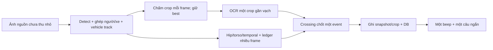

# Best plate, tư thế góc bên và một cảnh báo mỗi lượt xe

Ngày thực hiện: 2026-10-01. Phạm vi: bốn vấn đề trong yêu cầu người dùng; giữ định danh xe, ROI polygon, vạch hai điểm và bottom-center anchor. Không thay trọng số hoặc dependency, không đổi schema/DB/media vận hành. Các thay đổi có sẵn của người dùng được giữ nguyên.




## 1. Tệp đã sửa/thêm

| Tệp | Thay đổi trong lượt này |
|---|---|
| `app/cv/best_plate.py` (mới) | Crop nguồn, chấm chất lượng, giữ một candidate, gửi một attempt, retry kỹ thuật cùng crop, buffer/queue hữu hạn |
| `app/cv/capture.py` | Thêm `read_source_frame()` giữ pixel nguồn; `read_frame()` cũ vẫn tương thích |
| `app/cv/ocr.py` | Normalize đầy đủ, sửa ký tự theo vị trí, upscale 2–3×, CLAHE/sharpen nhẹ, hai dòng, lỗi engine riêng, khóa reader dùng chung |
| `app/cv/pose.py` | Scorer góc bên và lịch sử người–xe; chân bị che là feature unavailable |
| `app/cv/evidence.py` | Snapshot bằng chứng đã xác nhận, không đếm lại frame |
| `app/cv/crossing_alert.py` (mới) | Chốt issues của lượt xe và dựng câu ngắn |
| `app/cv/pipeline.py` | Nối best crop/side-view/ledger vào vòng chạy; worker chốt crossing; giới hạn chờ OCR, kiểm tra metadata/deadline và bằng chứng trước audio |
| `app/cv/recognition_cards.py` | Dùng crop biển được chọn, đúng metadata frame; trả debug OCR/tư thế |
| `app/config.py`, `.env.example` | Quality/margin/confidence, deadline, rate/volume và debug flags |
| `app/api/guard.py` | `/guard/audio/config` và tải đúng crop đã chọn qua `/guard/plate_best/{track_id}`; có phân quyền/epoch |
| `frontend/src/components/RecognitionLogPanel.jsx` | Một attempt, frame/size/chất lượng/blur/confidence/contrast, raw hai dòng, tải crop, feature tư thế |
| `frontend/src/components/AlertBanner.jsx` | Một oscillator beep và một audio dispatcher; lấy cấu hình server; giữ lease loa |
| `frontend/src/utils/alertAudio.js`, `alertFilter.js`, `speak.js` | Message ngắn, một job theo crossing, dedup/TTL/cancel, áp dụng rate/volume thật |
| `frontend/vite.config.js` | Proxy endpoint tải crop |

Test mới: `test_best_plate.py`, `test_best_plate_api.py`, `test_crossing_alert.py`, `test_vehicle_crossing_aggregation.py`, `frontend/test/crossingAudio.test.mjs`. Bổ sung/điều chỉnh test tư thế, recognition, audio và Chromium theo hợp đồng mới. E2E admin/login/guard cũ được chuyển sang `frontend/e2e/isolatedFixture.js`, không còn gọi backend 8000 hoặc tạo cảnh báo trên DB thật. Không dùng token/credential vận hành trong fixture.

## 2. Số lần OCR trước/sau

Trước: `_read_plate_voted()` tiếp tục gửi khi chưa có kết quả confident; cache confident cũng hết hạn theo cửa sổ. Không có giới hạn số attempt cho một crossing. Số thực tế phụ thuộc thời gian xe trong ROI và tốc độ worker; chưa đo một con số cố định trên camera thật.

Sau: `BestPlateStore.trigger()` chỉ gửi **một recognition attempt/vehicle/source/crossing sequence**. Candidate bị đóng băng khi gửi. Một lỗi engine có thể retry **đúng crop đó tối đa một lần**; text rỗng, partial hoặc confidence yếu không retry ảnh khác. Đếm riêng `attempts=1` và `technical_retries`.

Regression đưa 10 crop trước trigger chứng minh crop số 10 có quality cao nhất được gửi đúng một lần; crop sau trigger không thay thế. Đây là best **đã thu tại thời điểm trigger**, không khẳng định biết trước ảnh đẹp nhất trong tương lai. Với biển hai dòng, một attempt có hai lời gọi `readtext()` cho hai phần của cùng crop.

Helper voting cũ còn giữ cho script/test tương thích; vòng live dùng `_observe_best_plate()` và `_process_vehicle_crossings()`, không gọi đường tạo alert riêng theo từng lỗi hoặc OCR voting cũ.

## 3. Công thức quality crop

Các thành phần được giới hạn về `[0,1]`:

| Thành phần | Trọng số | Cách tính |
|---|---:|---|
| Confidence detector | 0.20 | Confidence box |
| Kích thước | 0.20 | `min(1, sqrt(width*height/(160*80)))` |
| Độ nét | 0.25 | `min(1, log1p(LaplacianVariance)/log1p(500))` |
| Tương phản | 0.10 | `min(1, std(gray)/55)` |
| Exposure | 0.10 | Tỷ lệ pixel xám nằm trong `(25,235)` |
| Bbox đầy đủ | 0.10 | Diện tích crop thực / diện tích bbox đề nghị |
| Cách mép ảnh | 0.05 | Khoảng cách nhỏ nhất tới mép / `0.25*min(width,height)` |

`quality = sum(weight*feature)/sum(available weights)`. Crop mới phải tốt hơn crop cũ ít nhất `PLATE_BEST_REPLACE_MARGIN=0.05`, frame phải mới và chưa gửi OCR. Ngưỡng gửi sớm mặc định `PLATE_BEST_MIN_QUALITY=0.65`.

Nếu có bốn góc đo được, lồi và cạnh đủ dài, thêm thành phần perspective 0.10 dựa trên tỷ lệ cạnh đối diện. Detector hiện trả bbox trục, **chưa có bốn góc đủ tin cậy**: perspective không tham gia score và không warp đoán từ bbox. Do đó lượt này chưa nghiệm thu correction phối cảnh trên ảnh nghiêng. Quality này là heuristic chọn ảnh, không phải “độ chính xác OCR”.

## 4. Bằng chứng crop dùng độ phân giải nguồn

`WebcamStream.read_source_frame()` trả ảnh decoded trước resize. Pipeline giữ `_original_source_frame`; ảnh detect/hiển thị được thu nhỏ riêng, giữ tỷ lệ. Bbox display được nhân riêng theo `source_width/display_width` và `source_height/display_height`; `make_candidate()` copy pixel của ảnh nguồn chưa vẽ.

Test luồng quan sát thật so sánh pixel crop với lát cắt từ nguồn 300×200 và display 100×100. Test capture mạng mô phỏng nguồn 1920×1080 chứng minh accessor nguồn giữ kích thước đó. Endpoint PNG được decode và so sánh pixel chính xác với crop đã chọn, có kiểm tra quyền và epoch. Không lưu hàng chục crop tự động.

## 5. Biển hai dòng

Xác định hai dòng từ hình dạng crop; preprocess một crop bằng upscale 2–3×, CLAHE và sharpen nhẹ, chia trên/dưới, đọc mỗi phần một lần, sắp trái→phải và ghép trên→dưới. Confidence hai dòng lấy **min(top,bottom)**.

Test qua `read_plate_detailed()` ghi nhận hai lời gọi engine trên cùng crop: `89-F1` + `237.92` → `89F123792`. Normalize uppercase và bỏ ký tự ngoài A–Z/0–9. Sửa O/0, I/L/1, Z/2, S/5, B/8, G/6 chỉ tại vị trí bắt buộc; kết quả cạnh tranh cùng mức sửa bị từ chối. Không global replace. Format chưa hỗ trợ vẫn cần kiểm tra, không đoán.

## 6. Khi nào UNREADABLE

Không có crop, OCR chưa xong trước deadline, chuỗi chưa đầy đủ/không khớp cấu trúc hỗ trợ hoặc confidence dưới `PLATE_OCR_MIN_CONFIDENCE=0.70` → `UNREADABLE`. `23792` không được lookup DB. `CONFIRMED` ở đây nghĩa là đọc đủ format và đạt ngưỡng một crop, không phải chứng minh biển thật đã chính xác.

Exception/engine lỗi là `ERROR/needs_review`, không tự kết luận xe che biển. `NOT_REGISTERED` chỉ được thêm sau **full plate confident + lookup không có**. OCR đến sau deadline hoặc sai camera epoch/vehicle/frame không được thêm vào alert đã đóng.

Theo yêu cầu mới, **PLATE_UNREADABLE tại crossing đã chốt được đọc loa**. Log/crop đang kiểm tra và OCR-only chưa chốt vẫn im lặng; đây là thay đổi có chủ ý so với kế hoạch OCR vàng im lặng trước đó.

## 7. Riding score mới

`SideViewRiding.evaluate()` dùng hip 0.30, torso 0.25, pelvis/person–bike overlap 0.20, temporal 0.15, motion hỗ trợ 0.05, chân 0.05. Score chia cho tổng trọng số **feature có quan sát**.

RIDING cần body geometry mạnh: hip≥0.75, torso≥0.70, overlap≥0.55, score≥0.75; thêm temporal≥0.75 hoặc chân co nhìn rõ. Không dùng riêng IoU, motion hay score tổng để kết luận. Temporal state khóa theo người+xe+epoch, tối thiểu ba frame liên kết ổn định. Chỉ người đã ghép xe mới chạy pose.

WALKING_WITH_BIKE cần bằng chứng dương: chân duỗi nhìn rõ, thân đứng thẳng cạnh xe và quan hệ ổn định. Nếu không đủ, trả UNKNOWN. Các threshold là baseline hình học chưa hiệu chỉnh/đo precision cho góc camera trường.

## 8. Không thấy chân

Knee/ankle thiếu, confidence yếu hoặc geometry không hợp lệ → `leg=None`, `UNAVAILABLE`; loại trọng số chân khỏi mẫu số. Một phía hip/shoulder nhìn rõ được dùng, không yêu cầu hai knee/hai ankle hoặc straddle hai phía xe. Hip+torso+overlap+temporal mạnh vẫn có thể RIDING. Nếu hip/torso cũng bị che → UNKNOWN, tuyệt đối không tự đổi thành dắt xe.

## 9. Điều kiện RIDING_THROUGH_GATE

Xe máy có `vehicle_track_id` và người–xe liên kết; state hiện tại RIDING; ledger có ít nhất bốn quan sát hợp lệ trong 1.5s, trải≥400ms, cách≥100ms, frame mới và không có bằng chứng trái chiều; **crossing trên vạch đã cấu hình** mới chốt issue. UNKNOWN/dắt bộ qua vạch không tạo issue này.

Giữ thuật toán crossing **đang có trước lượt này**: bottom-center anchor, đoạn hai điểm thật, dead-zone, ba frame ổn định phía đầu rồi một frame rõ phía đối diện; latch/rearm với cooldown 2s và khoảng cách 0.05. Không quay về giả định 3+3 của các tài liệu cũ, vì yêu cầu mới nói giữ crossing hiện tại. Không có vạch thì chỉ chọn crop, chưa chốt OCR/alert; UI thông báo rõ.

## 10. Hàm aggregate

`VideoPipeline._process_vehicle_crossings()` gom mọi người cùng vehicle, đóng băng issues/crop/frame/source/future. `_finish_crossing_event()` chạy ở worker riêng; `aggregate_crossing_event()` trong `crossing_alert.py` tạo một event. Giữ mũ từng người, cưỡi xe theo xe, biển và quy tắc số người đã có trong cùng lượt.

`crossing_event_id` UUID dựa trên gate/camera/phiên/vehicle/thời điểm crossing. Sealed IDs và lần crossing cuối của xe chặn tạo lại; source mới reset trạng thái. OCR chỉ chờ tối đa `ALERT_MAX_PLATE_WAIT_MS=150` (giới hạn 200), tính từ lúc crossing chốt, không từ lúc worker bắt đầu. Result cuối không cập nhật lời đọc cũ. Queue OCR và queue chốt đều hữu hạn, không block capture để đợi OCR.

## 11. Hàm message

Backend: `build_alert_message()` trong `crossing_alert.py`. Browser: `buildAlertMessage()` trong `alertAudio.js`; chỉ đọc issues confirmed được cấp quyền. Câu theo thứ tự biển → chưa đọc được biển → mũ → dắt xe:

| Kết quả | Câu |
|---|---|
| Biển rõ + mũ + riding | `89 F1 237 92. Không đội mũ, vui lòng dắt xe.` |
| Biển rõ + riding | `89 F1 237 92. Vui lòng dắt xe.` |
| Biển rõ + mũ | `89 F1 237 92. Vui lòng đội mũ.` |
| Biển chưa rõ + hai lỗi | `Không đọc được biển số. Không đội mũ, vui lòng dắt xe.` |
| Chỉ chưa rõ biển | `Không đọc được biển số.` |
| Không lỗi | Không beep/TTS lỗi |

Không đọc tên học sinh hoặc internal code. Các lỗi khác đang hỗ trợ dùng lời nhắc ngắn trong cùng job; gương tiếp tục review-only mặc định.

## 12. Beep gọi ở đâu, chống lặp thế nào

`createAlertAudio().accept()` nhận **event đã đóng**, kiểm tra quyền loa/bằng chứng/TTL rồi dedup bằng gate+camera+epoch+vehicle+crossing_event_id. `dispatch()` gọi `playAlertSound()` đúng một lần; hàm này tạo **một oscillator**, sau beep gửi một `speakVietnamese(message, options)`.

Snapshot/crop bắt buộc đã ghi thành công và DB đã commit trước `_push_alert()`. Thất bại không có URL giả hoặc audio chính thức. Một event update/thêm lỗi đến trễ không tạo audio thứ hai. Một phiên loa có lease; viewer khác im lặng. Tắt loa/unmount/đổi phạm vi dọn timer và speech. Queue câu tối đa hai, TTL5s. Replayed/historical event không phát lại.

`DEBUG_ALERT` backend ghi job dự kiến trước persistence; browser ghi `beep_calls/tts_calls` khi gọi API phát. Đây là **số lời gọi yêu cầu phát**, không chứng minh loa vật lý đã phát thành công. Chromium stub quan sát một oscillator start và một utterance, không đo âm lượng nghe được hoặc giọng Windows thật.

## 13. TTS rate trước/sau

Trước dispatcher dùng 1.15 cho cảnh báo cao (các caller có thể 1.0/1.15). Sau `/guard/audio/config` trả `TTS_SPEECH_RATE`, mặc định **1.30**, giới hạn 0.9–1.4; áp dụng vào `SpeechSynthesisUtterance.rate`. So với1.15 tăng numeric rate khoảng13%; tốc độ nghe thực tế phụ thuộc voice. Browser test cấu hình1.32 ghi nhận utterance.rate=1.32 thật.

## 14. TTS volume trước/sau

Engine hiện tại **Web Speech API trong browser**. Trước không gán volume, mặc định engine là1; sau gán rõ `SpeechSynthesisUtterance.volume=TTS_VOLUME`, mặc định **1.0**, range0–1. Test cấu hình0.95 ghi nhận utterance.volume=0.95. Không tự đổi system master volume. Vì trước đã dùng default1, việc này không thể khẳng định tăng âm lượng nghe được; nếu vẫn nhỏ cần kiểm tra mixer/loa/voice thực tế. Gain beep trong ứng dụng giữ0.6.

## 15. Kiểm thử, trạng thái bàn giao và giới hạn

Baseline trước sửa: **551 backend passed, 1 warning,177.69s**. Trong phát triển đã tái hiện fail cho metadata/deadline và hồi quy số người; sửa trước lượt full cuối. Một lỗi chọn native accessor trên MagicMock gây treo đã sửa bằng kiểm tra method trên class thật; không bỏ test.

| Bộ kiểm chứng | Kết quả cuối |
|---|---|
| Backend toàn bộ `app/tests` | **606 passed,0 failed,0 skipped**,144.21s; một warning `python_multipart` |
| Node toàn bộ `frontend/test/*.test.mjs` | **22 passed,0 failed,0 skipped**,5.35s |
| Chromium toàn bộ sáu spec | **39 passed,0 failed,0 skipped**,khoảng1.3 phút; API/media/source giả |
| Frontend lint | Exit0; còn19 warning hiện có, không có error |
| Frontend production build | Exit0; còn warning chunk869.96KB>500KB |
| Ruff helpers/pose/test mới | All checks passed |

Lệnh:

```powershell
.\venv\Scripts\python.exe -m pytest app/tests -p no:cacheprovider --tb=short -q
.\venv\Scripts\ruff.exe check app/cv/best_plate.py app/cv/crossing_alert.py app/cv/pose.py app/tests/test_best_plate.py app/tests/test_best_plate_api.py app/tests/test_crossing_alert.py app/tests/test_vehicle_crossing_aggregation.py app/tests/test_riding_geometry.py
cd frontend
node --test test/*.test.mjs
npm run lint
npm run build
# E2E cần Vite riêng chạy tại127.0.0.1:5186 (API đều được fixture chặn).
npm run dev -- --host 127.0.0.1 --port 5186 --strictPort
# Terminal khác:
npx playwright test --project=chromium
```

### Model và phiên chạy thực

Không thay model/tracker trong lượt này. API bản chạy thử xác nhận người/xe `yolov8n.pt`, mũ `helmet_best_20260930_090903.pt`, biển `plate_best.pt`, device cuda:0, OCR EasyOCR, ByteTrack; pose `yolov8n-pose.pt`. YOLO11/BoT-SORT chưa đưa vào runtime.

SHA256:

```text
plate_best.pt: 5b57ca666211a4b7dffd6fed662dcfda3c0504eed2534338660372ce80290817
helmet_best_20260930_090903.pt: c8eb324e365cf4faeab491d9cc301535ec745171b55e8b1acadea62be5101a9d
yolov8n.pt: f59b3d833e2ff32e194b5bb8e08d211dc7c5bdf144b90d2c8412c47ccfc83b36
yolov8n-pose.pt: c6fa93dd1ee4a2c18c900a45c1d864a1c6f7aba75d84f91648a30b7fb641d212
```

Đã restart **chỉ backend kiểm tra cách ly** để chạy code mới, giữ nguồn đã chọn và cấu hình vạch. API trả200 cho health/cards/audio config; running/thread_alive/camera_open true, tuổi frame0.06s tại một lần lấy mẫu. Nguồn hiện chọn là webcam index0; không tự đổi về RTSP hoặc OBS index1 từ lịch sử. Một snapshot tuổi frame không phải kết quả p95/FPS/endurance. Giao diện cuối có thẻ người nhưng chưa ghép xe/biển; không dùng thẻ này để khẳng định OCR đã đọc được biển thật.

Ảnh giao diện thực (pane model): `docs/best-plate-live-preview.png`. Ảnh thẻ best crop với **fixture kiểm thử**: `docs/best-plate-fixture-preview.png`; số biển/score trong ảnh này là dữ liệu giả, không phải nhận diện camera thật.

Chưa nghiệm thu: accuracy OCR trên≥30 biển rõ, precision/recall mũ/hành vi, FPS/p95 hai camera Imou, giọng/âm lượng loa máy bảo vệ, ca12h. Capture/detect/pose cũ vẫn có phần cùng vòng xử lý; không mô tả lượt sửa một-crop này là hoàn tất toàn bộ kế hoạch tách capture/GPU fairness. Gương và tự ghép trước/sau chưa bật. Chọn crop tốt không khôi phục chi tiết không có trong nguồn.

### Cấu hình và quay lại

Cấu hình mẫu nằm trong `.env.example`; không đổi `.env` vận hành. DEBUG flags ghi vào diagnostics/card/overlay, không tạo alert riêng. File trọng số cũ không bị ghi đè.

Snapshot trước lượt sửa: `C:\Users\khucv\AppData\Local\Temp\best_plate_before_jyl_gl7d`. Nếu cần rollback, đối chiếu/khôi phục **từng tệp của lượt này**, giữ các chỉnh sửa khác; không `git reset/clean/restore` cả working tree. Snapshot này không bao gồm thay đổi proxy Vite; xem diff riêng cho `/guard/plate_best`. Chưa commit hoặc push.
